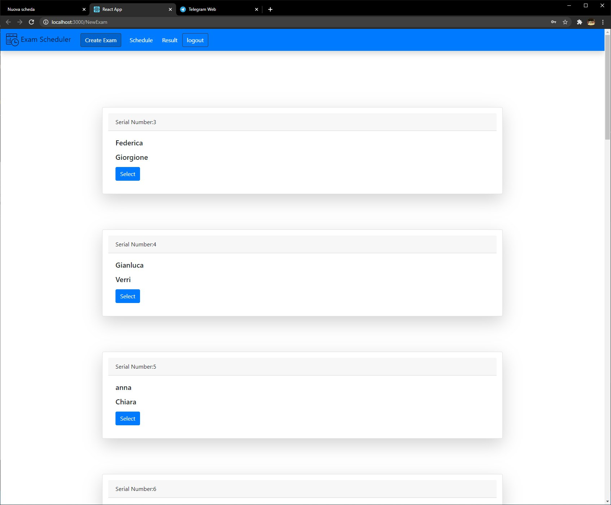
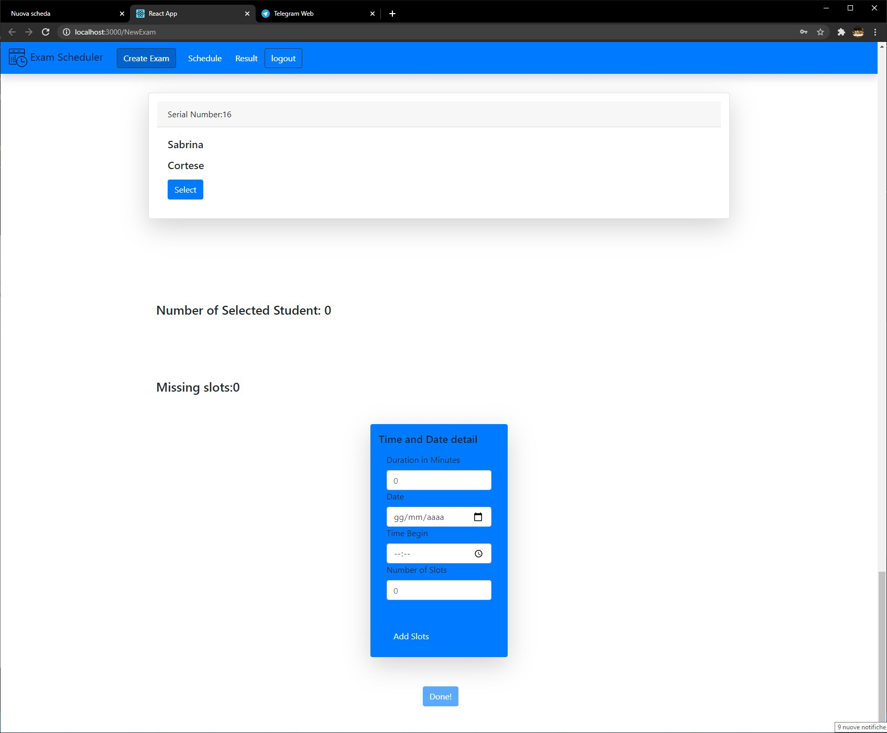
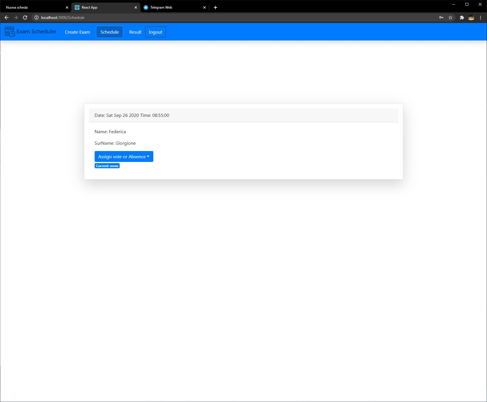
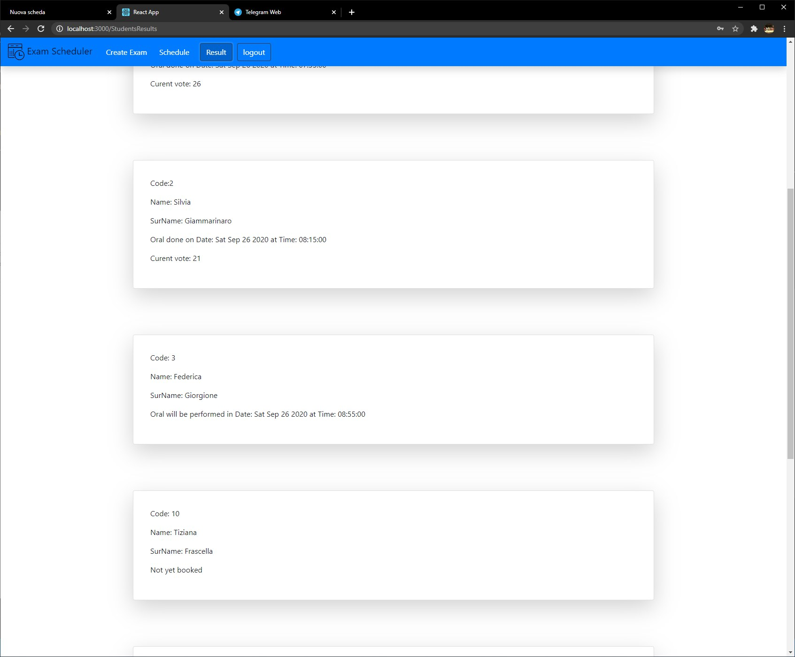
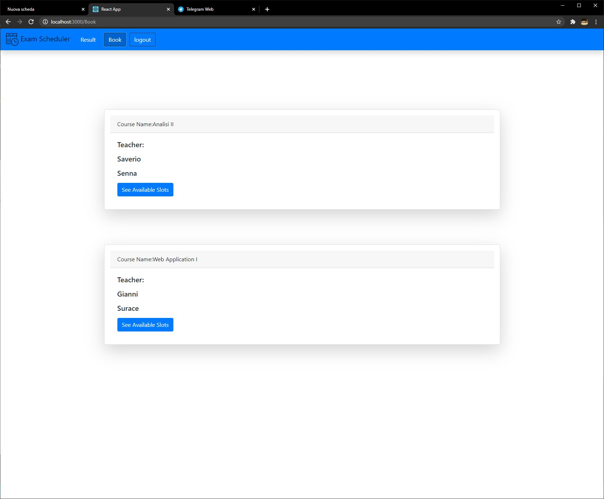
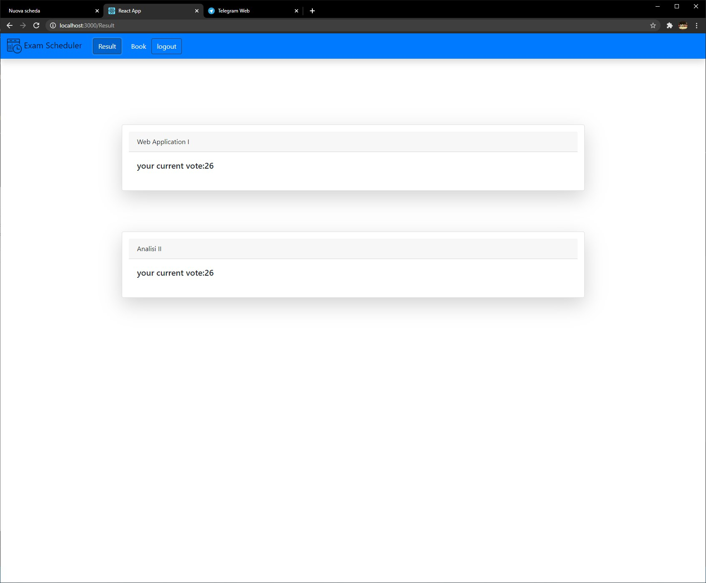
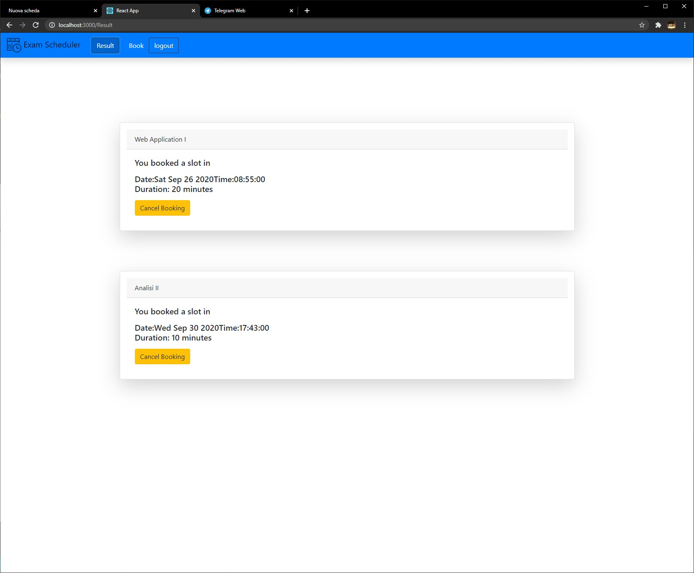
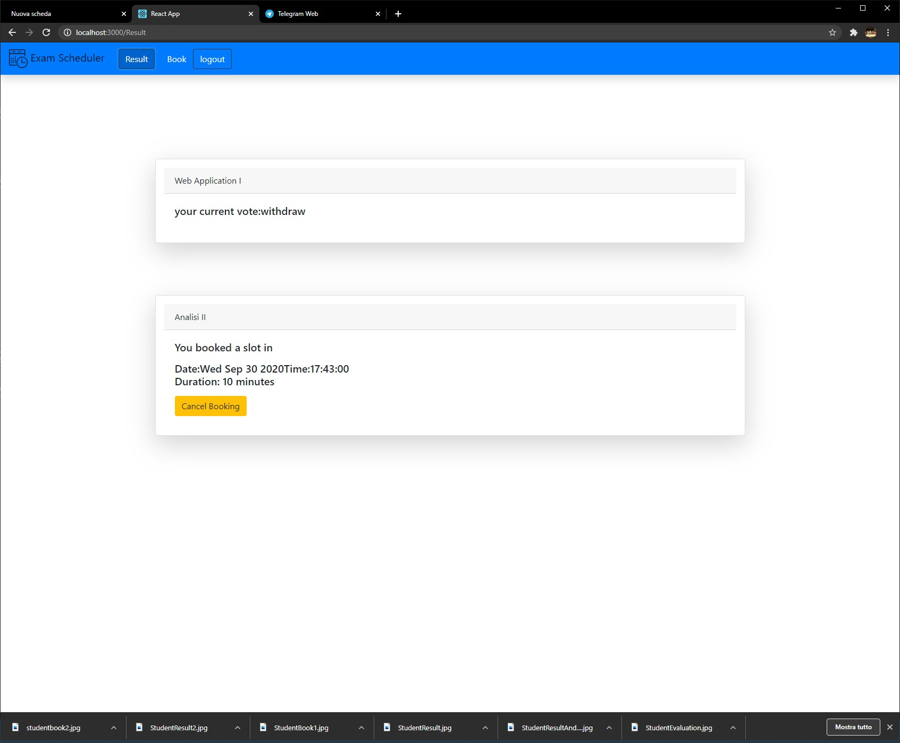

# Exam #12345: "Exam Title"
## Student: s123456 LASTNAME FIRSTNAME 

## React client application routes

- Route `/`: Redirect to login page
- Route `/login`: login page for both student and teacher
- Route `/NewExam`: allow the tacher to create bookable slots
- Route `/Schedule`:  allow teacher to assig vote
- Route `/StudentsResults` :allow teacher to seee students results, if they are booked or not ad when 
- Route `/Book`: allow student to book their slots for oral exams
- Route `/Booking/:call`: show every slot for the call selected
- Route `/Result`: show every vote and every booked slot
- Route ``
- ...

## REST API server

- POST `/api/login`
  - request parameters and request body content: for teacher contein teacher code and password, for student contein only the student code, server will understand the difference based on the first letter of the code.
  - response body content
- POST `/api/logout`
  - request parameters and request body content : none
  -request body : none 
  - response body content : none

- GET `/api/getAllStudent/`
  - request parameters : none
  -request body : none 
  -response body content : all student that never done the exam or failed previously

- POST `/api/session`
  - request body contain : all slots created by the teacher
  - request parameter : none
  - response body : call code

- POST `/api/selectedStudents/`
  - request parameter none
  - request body contein all selected student's code and the call code
  - response body empty

- GET `/api/BookableExams/`
  -request parameters: none
  -request body: empty
  -response body contains all Bookable exam for the student

-GET `/api/allSlots/:call`
  -request paramerters: call is the code of the call 
  -request body: empty
  -response body contains: all slots for that call

- POST `/api/bookSlot/:call/:date`
  -request parameters: call code and date of the selected slot
  -request body: empty
  -response body: empty

- DELETE `/api/bookSlot/:call/:date`
  - request parameters: call code and date for the selected slot
  - request body: empty
  - response body: empty

- GET `/api/BookeSlots/`
  - request parameters: none 
  - request body content:none
  - response body content: all student that booked the exam call

- POST `/api/updateVote/`
  - request parameters: none
  - request body content: mat and vote, code of the student and his/her code 
  - response body content: none

- GET `/api/StudentsResults/`
  - request parameters: none 
  - request body content: none
  - response body content: contains all student selected for the exam

- GET `/api/getResults/`
  - request parameters:none 
  - request body content: none
  - response body content:contains every booked slot or exam vote

- POST `/api/something`
  - request parameters 
  - request body content
  - response body content
## Server database

- Table `teachers` - contains code name surname course_name
- Table `students` - contains code name surname
- Table `results` - contains selected student for each couse, eventually the vote/presence/absence 0 otherwise and validity for a future selection. mat exam vote passed
- Table `exam_slots` contains every information about an exam slot. exam day time duration booked mat call
-Table `exam_call` contain mapping between a course and each call. exam call
- Table `call_students` contain mapping between each call and the selected student that can book the call. call student  
- Table `something` - contains ww qq ss
- ...

## Main React Components

- `LoginForm` (in `App.js`): show the login conteiners and allow login
-  `ExamCreator` (in `App.js`): allow teacher to create new bookable slots
-  `StudentCard` (in `App.js`): allow view of each bookable student 
-  `Book` (in `App.js`): show to students each bookable exam call
-  `Examcard` (in `App.js`): give info and about the exam and give the possibility to show all slot of each exam call

-  `AllSlots` (in `App.js`): show each bookable, busy or yet booked slots. giving the possibility of booking only one slot at time

-  `SingleSlot` (in `App.js`): contain information about the single slot and button to book or cancel booking

-  `Schedule` (in `App.js`): Give the possibility to show each booked student and assign a vote

-  `ScheduleSlot` (in `App.js`): show info about the single student

-  `StudentResult` (in `App.js`): show every student selected for every exam call whit their vote, their booked date (also not booked ones)

-  `SingleStudent` (in `App.js`): show details of the single student

-  `Results` (in `App.js`): show every exam with the results if jet done otherwise show the booked slot

-  `SIngleExam` (in `App.js`): give info about the single exam

## Screenshot

Login page

Exam Creation (teacher)

Student Evaluation (teacher)

Students Results (teacher)

Bookable Exam Calls (student)

Student Results (student)

## Test users

* t1, 12345 teacher 
* t2, 12345 teacher
*  s1 to s16 students password not required

